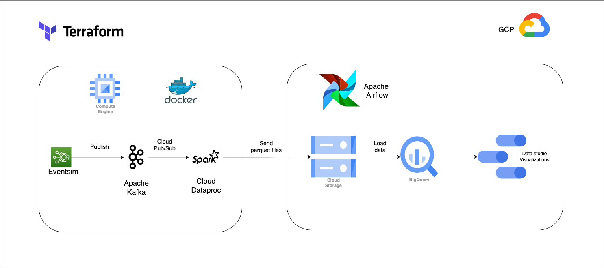
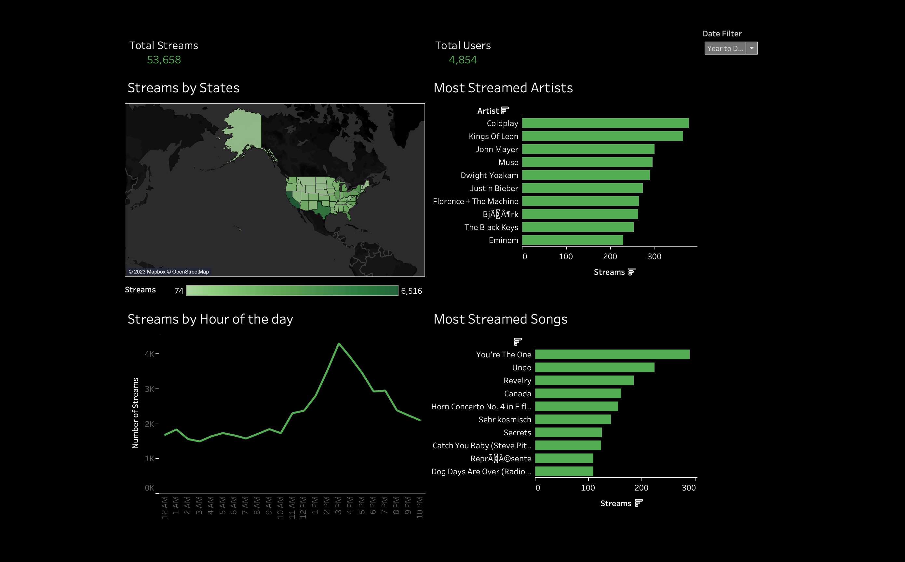

# music-streaming-pipeline
- [Music Streaming ETL pipeline](#music-streaming-pipeline)
    - [Description](#description)
    - [Architecture](#architecture)
    - [Dashboard](#dashboard)
    - [Setup](#setup)

## Description
[Eventsim](https://github.com/Interana/eventsim) is a fake streaming service (think of Spotify). It can be used to generate stream events by random users. This project was setup to consume the streaming data being generated by Eventsim. The events are published to Apache Kafka and Apache Spark consumes and processes the data from the Kafka topics. The processed data are then stored in a data lake (GCS) in parquet files. Apache airflow is then used to orchestrate the workflow of writing the files in the data lake to the data warehouse (BigQuery). Google datastudio is then used to visualize metrics from the Dataset. All of the vms are hosted on GCP.

## Architecture 

### Tools
- Cloud provider: Google Cloud Platform 
- Infrastructure as code (IaC): Terraform
- Containerization: Docker 
- Stream Processing - Apache Kafka, Apache Spark (Dataproc)
- Workflow Orchestration - Apache Airflow
- Data Lake: Google Cloud Storage
- Data Warehouse: BigQuery 
- Data Visualization: Tableau

    

## Dashboard

    

## Setup

# :construction_worker: Infrastructure setup
- Set up a GCP account
- Ensure you have an account with billing setup 
- Set up a new project if you do not have one 
- Deploy necessary infrastructure with Terraform [Deploy Infrastructure](https://github.com/Adedotun-Adepoju/music-streaming-pipeline/blob/main/terraform/README.MD)
- Set up Kafka instance on VM and publish messages to kafka topics [Kafka setup](https://github.com/Adedotun-Adepoju/music-streaming-pipeline/blob/main/kafka/README.md)
- Set up Spark Dataproc cluster to consume messges from Kafka topics [Spark setup](https://github.com/Adedotun-Adepoju/music-streaming-pipeline/blob/main/spark/README.md)
- Orchestrate workflow with Apache Airflow and CRON jobs [Airflow setup](https://github.com/Adedotun-Adepoju/music-streaming-pipeline/blob/main/airflow/README.md)
- You can view the Dashboard that has been setup to monitor some metrics [dashboard](https://public.tableau.com/views/MusicStreamsDashboard/Dashboard2?:language=en-US&:display_count=n&:origin=viz_share_link)